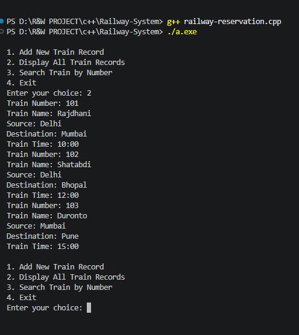
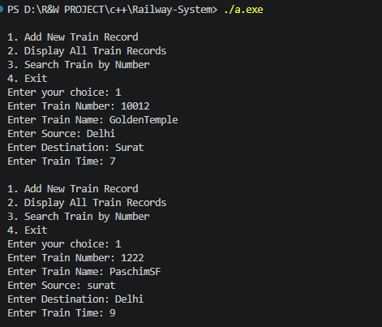
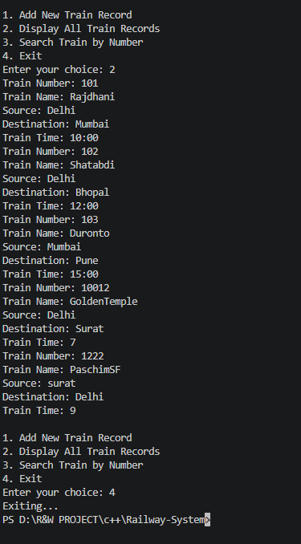
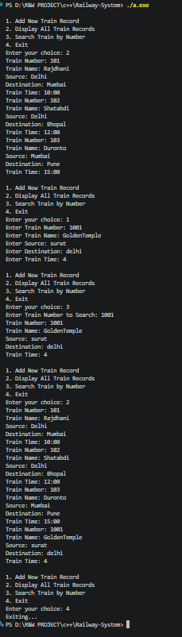

# Railway Reservation System

A beginner-friendly **Railway Reservation System** developed in C++ using Object-Oriented Programming (OOP) concepts.

## 📌 Project Overview

This project is a menu-driven console application for managing railway train records.

The system allows users to:
- Add new train records
- Display all train records
- Search for a train by train number
- Exit the application

The project also demonstrates classes, objects, constructors, destructors, static members, getters, setters, encapsulation, and an array of objects.

## 🛠️ Technologies Used

- **Language:** C++
- **Libraries:** `iostream`, `cstring`
- **IDE:** Visual Studio Code
- **Compiler:** C++ compiler

## ✨ Features

### Add New Train Record
Enter the:
- Train Number
- Train Name
- Source
- Destination
- Train Time

### Display All Train Records
Displays all train records currently stored in the system.

### Search Train by Number
Searches for a train using its train number and displays its details when found.

### Initial Records
The system starts with three sample train records.

## 🧱 OOP Concepts Used

- **Class and Objects**
- **Encapsulation** using private data members
- **Default Constructor**
- **Parameterized Constructor**
- **Destructor**
- **Static Data Member**
- **Getters and Setters**
- **Array of Objects**
- **Member Functions**

## 🏗️ Class Structure

### `Train`

The `Train` class stores information about an individual train.

It contains:
- Train Number
- Train Name
- Source
- Destination
- Train Time

It also provides constructors, getters, setters, input, display, and destructor functions.

### `RailwaySystem`

The `RailwaySystem` class manages multiple `Train` objects using an array of 100 trains.

Main functions:
- `addTrain()`
- `displayAllTrains()`
- `searchTrainByNumber()`

## 📋 Menu

```text
1. Add New Train Record
2. Display All Train Records
3. Search Train by Number
4. Exit
```

## 📸 Program Output

### Output 1



### Output 2



### Output 3



### Output 4



## ▶️ How to Run

### Compile

```bash
g++ railway-reservation.cpp -o railway-reservation
```

### Run

Windows:

```bash
railway-reservation.exe
```

Linux/macOS:

```bash
./railway-reservation
```

## 📁 Project Structure

```text
RailwayReservation/
│
├── railway-reservation.cpp
├── railway-reservation.exe
│
└── output/
    ├── output-1.png
    ├── output-2.png
    ├── output-3.png
    └── output-4.png
```

## 👨‍💻 Assignment

**Railway Reservation System — C++ OOP Assignment**

An individual C++ assignment focused on implementing a railway record management system using fundamental Object-Oriented Programming concepts.